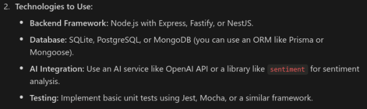
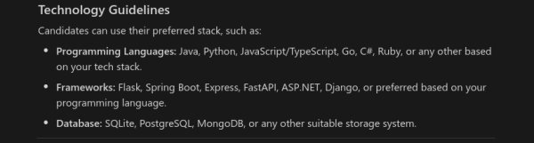

# PrioritAIzeMe
An intelligent task manager that allows users to create, read, update, and delete tasks, while using AI to prioritize them based on their sentiment.

## Note
I started working on the project on Friday, 25.12.2025. ***The current task requirements differ from the original task requirements, which I first received.*** For example:

Original requirements:

Current requirements:

I would like to point out that the original requirements, based on which I developed the project, made the task more difficult for me, because I was required to work with a tech stack, that I wasn't familiar with. In fact, the only familiar technologies from the original requirements were SQLite and PostgreSQL, as I am coming from a predominantly C++ and Java background. 

Nevertheless, I managed to produce an efficient solution, satisfying both the original and the updated requirements, as well as providing additional features. 

## Features
### Tech Stack
This project was built using Nest.JS over Fastify (unlike the default Express.js base) to maximize performance and facilitate easy project maintenance. 

The REST API is documented and type-enforced using `Swagger` and `class-validator`. For complete API documentation, refer to `swagger.html` or `localhost:3000/api` (when running the project).

The REST API has been tested for consistency in `Postman`. 
### Resources
The REST API implements endpoints for `users` and `tasks`. In addition, `project` entities have been added, which allow grouping tasks together. Tasks can either be standalone or part of a project. 

A user's tasks, projects and personal credentials, are protected from unauthorized access by other users using `JWT` tokens. 
#### Users
| field               | type                     | Description                                |
| ------------------- | ------------------------ | ------------------------------------------ |
| username            | String                   | Username - unique name in the system       |
| email               | String                   | Email - unique in the system               |
| hashedPassword      | String                   | Hashed User Password                       |
| firstName           | String                   | First Name                                 |
| lastName            | String                   | Last Name                                  |
| role                | UserRole = {USER, ADMIN} | Ordinary user or admin                     |
| tasks               | Task[]                   | Tasks that the user created                |
| projects            | Project[]                | Projects that the user owns                |
| TaskAssignees       | User[]                   | Tasks that the user is assigned to         |
| ProjectParticipants | User[]                   | Projects that the user is a participant of |

#### Projects
| field               | type    | Description                       |
| ------------------- | ------- | --------------------------------- |
| name                | String  | Name                              |
| description         | String? | Description                       |
| owner               | User    | The user, who created the project |
| tasks               | Task[]  | Tasks that belong to the project  |
| ProjectParticipants | User[]  | Participants of the project       |

#### Tasks
| field               | type      | Description                                                          |
| ------------------- | --------- | -------------------------------------------------------------------- |
| title               | String    | Title                                                                |
| description         | String?   | Description                                                          |
| dueDate             | DateTime? | The end date goal                                                    |
| created             | DateTime  | When the task was created                                            |
| creator             | User      | The user, who created the task                                       |
| completed           | Boolean?  | Has the task been completed                                          |
| sentiment           | Float?    | Sentiment score, based on description                                |
| normalizedSentiment | Float?    | Normalized sentiment score, which allows length-agnostic comparison  |
| priority            | Priority  | Assigned automatically (by sentiment score), or manually by the user |
| project             | Project?  | The project that this task is part of (if any)                       |
| assignees           | User []   | The users, responsible for completing the task                       |

The SQL schema closely follows the conceptional object `Prisma` models above, but is optimized to reduce row and column repetitions by following the Boyce-Codd Normal Form guidelines. Usage of nested objects and circular dependencies is completely avoided. 

## Setup Instructions
1. Clone the project
2. Install dependencies using `npm install`
3. Set database credentials in a `.env` file
4. Populate the database with sample data: `prisma db seed` (optional)
5. Run using `npm run start`
6. Create a user and login or login using an existing user's credentials
7. Use the received `Bearer token` to authenticate further requests

## Possible Future Improvements
- `sentiment` works for English by default. Sentiment analysis could be improved for other languages:
  - by first running a model, which determines the language description and then running `sentiment` for the discovered language
  - by using a neural model, which is language-agnostic. This would increase third-party dependencies and that's why I avoided this option.  
- `OpenID Connect` Authentication and Authorization - offers standardized and superior security to regular `JWT`s, as well as third-party integration by means of: 
  - ID Token
  - Access Token
  - Refresh Token
- more detailed API documentation (more Swagger annotations)
- more rigorous testing

